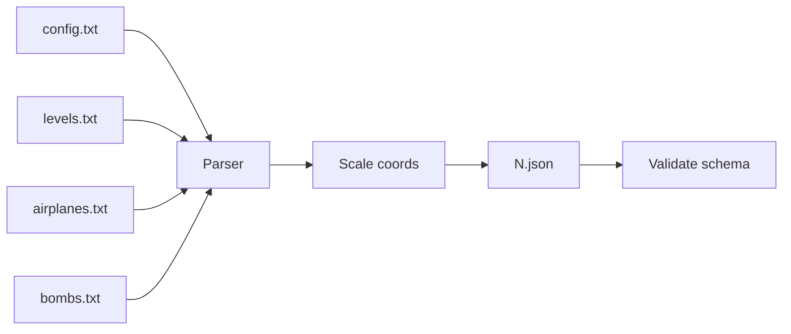

# 04 — Porting v1 Data to JSON

How to convert `old/data/<campaign>/` text files into `public/campaign/<id>/N.json`.

Reference: `old/levels_selbermachen.txt` (original SDK).

---

## v1 folder structure

Each campaign requires exactly four files:

```
old/data/mangoo_easy/
  config.txt
  levels.txt
  airplanes.txt
  bombs.txt
```

Optional: `highscore.txt` (local arcade scores — not needed for gameplay).

---

## Conversion pipeline



### Step 1 — Parse INI-style text

Rules from v1 SDK:

- `//` starts a line comment
- `[SECTION_NAME]` starts a block (round name, airplane type, bomb type)
- `KEY: value` or `KEY:value` (space optional)
- Round sections in `levels.txt` → `rounds[]` in array order
- Airplane/bomb sections → keyed objects

### Step 2 — Scale coordinates

v1 used **1024×768**. New design space is **1920×1080**.

```
x_new = x_old × (1920 / 1024)   // 1.875
y_new = y_old × (1080 / 768)    // 1.40625
```

Apply to:

- All spawn `x`, `y` in rounds
- AI params that are Y coordinates (`KI_PARAM_A/B` for most AIs)
- AI params that are X coordinates (`KIPARACHUTE` uses Start_x, End_x)

**Do not scale:** HP, explosion ranges (tune separately if needed).

**Convert to per-second units** (v1 used 60 Hz frame ticks):

| v1 field | JSON field | Conversion |
|----------|------------|------------|
| `SPEED` | `speed` | × 60 → **px/s** |
| `ROTATION_SPEED` | `rotationSpeed` | × 60 → **deg/s** |
| `START_ROCKET_SPEED` | `startRocketSpeed` | × 60 → **px/s** |
| `KI_PARAM_A/B` (Y) | `aiConfig.flightBand.minY` / `maxY` |
| `KI_PARAM_A/B` (X, parachute) | `aiConfig.glideTarget.startX` / `endX` |
| `KI_PARAM_C` | `aiConfig.dropIntervalSec` | ÷ 60 → **seconds** between drops |

`scripts/convert-v1.mjs` applies these automatically. One-time migration for existing JSON: `node scripts/migrate-per-second.mjs`.

### Step 3 — Remap paths

v1 paths are relative to `gfx/` or `sfx/`. Prefix with `assets/`:

```
IMAGE: bomber.png           → assets/gfx/AIRPLANES/bomber.png
CHANGE_BACKGROUND: mangoo.jpg → assets/gfx/backgrounds/mangoo.jpg
MUSIC: sfx/game.ogg          → assets/sfx/game.ogg
INTRO_IMAGE: AIRPLANES/bomber.png → assets/gfx/AIRPLANES/bomber.png
```

### Step 4 — Map field names

Use tables in [03-data-format.md](./03-data-format.md). Common renames:

| v1 | JSON |
|----|------|
| `TP` | `damage` |
| `DRAW_SCHWEIF` | `trail` |
| `BOMB_TYPS` + `BOMB_TYP_N` | `weapons: []` |
| `KI` | `ai` |
| `KI_PARAM_A/B/C` | `aiConfig` (named fields) |
| `EXPLOSION_TYP` | `explosion.type` |

### Step 5 — Merge into one file

Output structure per [03-data-format.md](./03-data-format.md).

---

## Campaign numbering

Map v1 story order from `old/data/campaign.txt`:

| JSON | v1 folder |
|------|-----------|
| `1.json` | `tutorial` |
| `2.json` | `mangoo_easy` |
| `3.json` | `boss1` |
| `4.json` | `overlord` |
| `5.json` | `mangoo2` |
| `6.json` | `boss2` |
| `7.json` | `fish` |
| `8.json` | `xr` |
| `9.json` | `boss3` |
| `10.json` | `Viech Chronicles` |
| `11.json` | `nuke` |
| `12.json` | `boss4` |

Note: `campaign.txt` references `Nuke` but folder is `nuke` (lowercase).

---

## Known v1 data quirks

Handle during conversion:

1. **Duplicate keys in levels.txt** — some rounds redefine `AIRPLANE_0` twice; last wins (verify in mangoo_easy round 5)
2. **Typos** — `BOMBER_HARD,100-100,0` missing comma (mangoo_easy) — fix manually
3. **WEATHER with 6 values** — boss1 has trailing comma/extra zero; take first 5
4. **`BUTTON_AIMTIME_DISABLED`** vs **`BUTTON_AIM`** — tutorial uses old name; map to `aim`
5. **Case in AI names** — `BOMBERHARD` vs `KI: BOMBERHARD`; normalize to enum in code
6. **Folder name with space** — `Viech Chronicles` — quote in scripts

---

## CLI script (planned)

```
scripts/convert-v1.ts --source old/data/tutorial --out public/campaign/1.json --id 1
scripts/convert-v1.ts --all --source old/data --manifest old/data/campaign.txt
```

Flags:

- `--scale` — apply 1024→1920 coordinate transform (default: on)
- `--copy-assets` — copy referenced gfx/sfx into `public/assets/`

---

## Asset copying

After conversion, collect all paths referenced in JSON:

- `config.assets.*`
- `config.sounds.*`
- `bombs.*.image`
- `airplanes.*.image`
- `rounds.*.background`, `ground`, `intro.image`

Copy from `old/gfx/` and `old/sfx/` → `public/assets/gfx/`, `public/assets/sfx/`.

Some graphics may only exist inside `AntiWar 1.5.app/Contents/` — extract if missing from standalone `old/gfx/`.

---

## Validation checklist

After each conversion:

- [ ] `BOMB_PLAYER` present
- [ ] Every spawn type exists in `airplanes`
- [ ] Every weapon exists in `bombs`
- [ ] Round count matches v1 `levels.txt` section count
- [ ] Spot-check 3 spawn coords visually in debug view
- [ ] Play round 1 in engine

---

## Round counts (reference)

| Campaign | Sections in levels.txt |
|----------|------------------------|
| tutorial | 3 |
| mangoo_easy | 16 |
| boss1–4 | 2 each |
| overlord | 7 |
| mangoo2 | 16 |
| fish | 5 |
| xr | 16 |
| nuke | 16 |
| Viech Chronicles | 6 |
| arcade | 40 |
| mangoo | 16 |
| schnappi | 7 |
