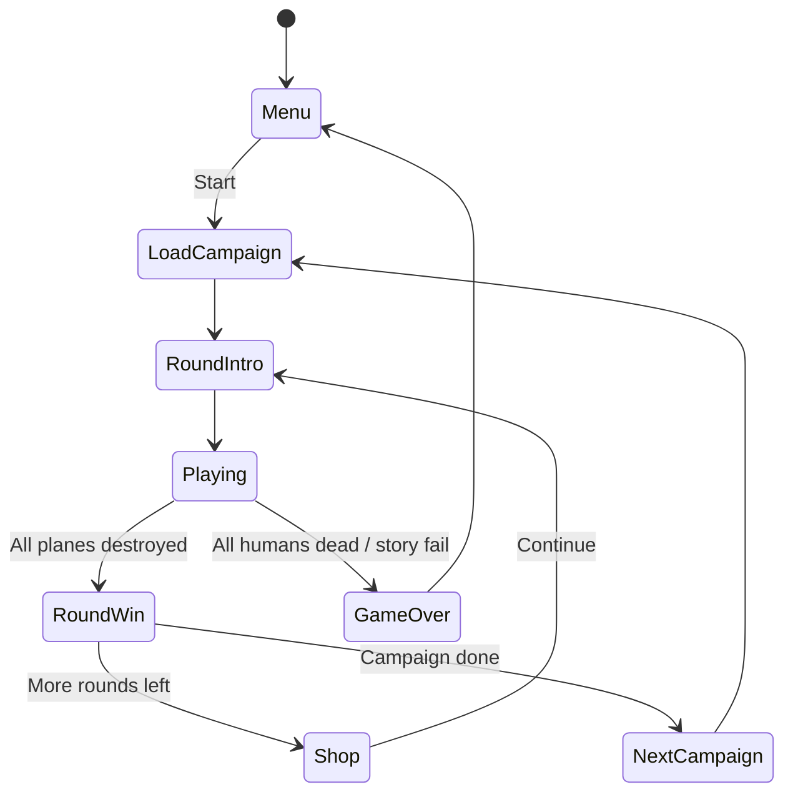

# 07 — Game Mechanics

Behavior reference ported from v1 (`readme.txt`, `levels_selbermachen.txt`, `old/data/`).

---

## Game loop



---

## Combat

### Turrets

- Each player has **left** and **right** turret
- Turret rotates to aim at that player's crosshair
- Firing spawns a rocket from `BOMB_PLAYER` template
- v1 tip: use left turret for left-side targets, right for right-side (shorter travel)

### Rockets (player)

Base stats from `BOMB_PLAYER` in level JSON, modified by runtime upgrades:

| Stat | Source |
|------|--------|
| Speed | `config.startRocketSpeed` × speed upgrade factor (**px/s**) |
| Damage | `config.startRocketPower` × power upgrade factor |
| Max in air | Fair split of `config.maxRockets` across active players (e.g. 5÷2 → 3+2) |
| Rotation | `BOMB_PLAYER.rotationSpeed` — **deg/s**, turns toward homing target |

Rockets start around **120–420 px/s** depending on level (`startRocketSpeed`). `checkOutOfScreen: true` — rockets can leave sides of screen.

**Speed cap:** v1.5 added max velocity on all objects to prevent tunneling / stuck rockets.

### Lock-on (guided rockets)

1. Keep crosshair on enemy until timer reaches 0
2. Start timer: `config.startAimTime` ms (reduced by aim upgrades)
3. Crosshair turns red
4. Next rocket(s) homing + bonus damage:

```
damage = baseDamage × aimPower × (startAimTime / currentAimTime)
```

`aimPower` from config (typically 2.0–3.0; tutorial uses 1000 — likely typo, clamp in remake).

### Bombs (enemy)

- Dropped by airplanes per AI drop interval (`aiParams[2]` seconds)
- Fall at `speed` **px/s** (typical enemy bombs: ~18–78 px/s)
- `checkOutOfScreen: false` — fall straight down
- On ground impact: damage civilians in `explosion.range`

### Airplanes

- Spawn at round start (queued by `maxAirplanes`)
- Follow AI waypoint patterns
- Have HP; show HP bar when high on screen or when `endmaster` boss bar active
- On death: explosion, possibly submunitions (`onDeath.bomb`)
- **Crashing:** after `crashingRockets` hits, plane falls and explodes on ground
- **Carrier:** spawns child planes; children die when parent dies
- **Stealth:** invisible for `stealthPhaseSec` seconds per phase, then visible for the same duration

### Civilians

- Walk on ground strip
- Have HP (`startHumanHp` + upgrades)
- HP bar shown when in red/low zone
- Die to bomb explosions → scream sounds
- **Survivors at round end** → each pays `humanMoney` (upgradeable)
- Buy more with Human upgrade button

### Win / lose

| Condition | Result |
|-----------|--------|
| All airplanes destroyed | Round win |
| All rounds complete | Campaign win → next JSON |
| All humans dead | **Instant game over** → main menu |
| Story limits exceeded | Fail (time, rockets, deaths, min money) |

---

## Economy & upgrades

Between rounds, spend money in the shop. **Spend everything** — prices rise exponentially (v1 tip).

### Seven upgrades

| Button | Effect | Price key |
|--------|--------|-----------|
| Human | +1 civilian (up to `maxHumans`) | `upgrades.human` |
| HP | Human HP × statFactor | `upgrades.humanHp` |
| Money | Money per survivor × statFactor | `upgrades.humanMoney` |
| Rocket | +1 to team concurrent rocket total (split across active players) | `upgrades.rocket` |
| Speed | Rocket speed × statFactor | `upgrades.rocketSpeed` |
| Power | Rocket damage × statFactor | `upgrades.rocketPower` |
| Aim | Aim time × statFactor (< 1 = faster) | `upgrades.aim` |

### Price escalation

```
nextPrice = currentPrice × priceFactor
nextStat  = currentStat × statFactor   (for HP, money, speed, power, aim)
```

Human price **resets** when civilians die (v1 behavior).

### Human HP refresh

If `humanHpRefresh === 1.0`, civilians restore full HP between rounds.

### Multi-kill money bonus

```
bonus = humanMoney × moneyFactor × streakMultiplier
```

Streak multiplier scales with consecutive kills without pause (double, triple, …).

---

## Score

v1 formula (v1.2+):

```
score = ((money / 10) × 3 × (unstoppable / unstoppableMax + 1)) / (humanDead / 3 + 1)
```

Lower time and fewer deaths → higher score. Kill streaks boost via unstoppable counter.

---

## Kill streaks

≥4 enemies destroyed in quick succession without long pause:

- Announce: doublekill, triplekill, multikill, megakill, monsterkill, ludicrous, holy shit, …
- Audio from `old/sfx/` (replace with original assets long-term)
- "Unstoppable" counter for score

---

## Explosion types

| Type | Name | Behavior |
|------|------|----------|
| 0 | None | No visual / damage cloud |
| 1 | Normal | Standard explosion sprite |
| 2 | Anthrax | Lingering toxic cloud |
| 3 | Nuke | Large blast, nuke sprite |
| 4 | Napalm | Ground fire, humans scream while burning |

Anthrax + napalm simultaneously caused v1 crashes — handle mutual exclusion or layered safely.

---

## Weather

Round `weather: [rain, clouds, snow, wind, darkness]` — each 0.0 to 1.0+.

| Index | Effect |
|-------|--------|
| 0 | Rain particles |
| 1 | Cloud overlay |
| 2 | Snow particles |
| 3 | Wind (-1 = left, +1 = right) affects particles/projectiles |
| 4 | Darkness — at > 0.4, night vision circle around **each crosshair** |

---

## Screen rumble

Round setting `rumble`:

| Value | Effect |
|-------|--------|
| 0 | Off |
| 1 | Plane explosions only |
| 2 | All explosions (default) |

Temporary camera offset; reset after shake duration. Disable during pause menu (v1 bugfix).

---

## Boss rounds

`endmaster: N` — show HP bar for spawn index N (usually 0).

Boss AIs: Baron, Vogel, RICE, BUSH — scripted patterns, not standard waypoints. See [08-ai-types.md](./08-ai-types.md).

---

## Hardcore mode

After beating campaign once:

- Enemy planes and bombs **2× speed**
- Unlock stored in profile/settings
- Strategy: prioritize speed upgrades

---

## Buy macros

From `buyscript.txt` — keys 1–9 buy predefined upgrade sequences.

- First keypress: instant
- Each additional purchase in sequence: **+100ms penalty**

Per-level overrides via named scripts (match round `name`).

---

## Autobuy / autofire

From `settings.txt`:

- **Autobuy:** buys cheapest upgrade; 10s penalty on use (story irrelevant)
- **Autofire:** hold button to repeat fire (NORMAL mode)

---

## Pause

Timer stops. No spawn progress while paused (v1.36+).

---

## Draw styles (airplanes)

| drawStyle | Rendering |
|-----------|-----------|
| 0 | Bomber — horizontal flip only (left/right) |
| 1 | Fighter — full rotation |
| 2 | Helicopter — nose tilt |

---

## Tips encoded in v1 readme

- Destroy all planes to finish round
- Protect civilians for money
- Buy humans up to max early
- Spend all money each shop phase
- Left turret for left targets, right for right
- Time attack: prioritize Speed + Aim early
