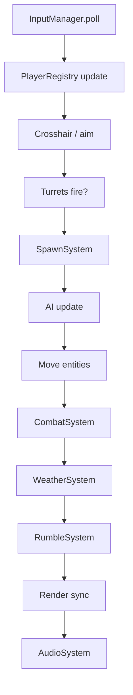
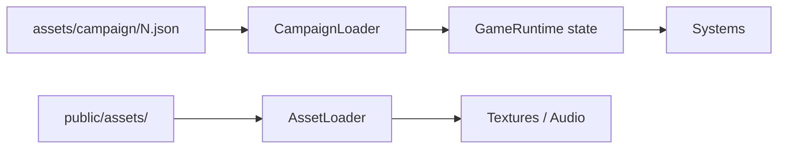

# 09 — Architecture

Code organization for the Vite + TypeScript + Pixi.js project.

---

## Directory layout

```
antiwar2/
├── docs/                    # This documentation
├── old/                     # v1 reference (do not ship)
├── public/
│   ├── assets/campaign/     # JSON + campaign art per id
│   └── assets/              # gfx/, sfx/ (ported from old/)
├── scripts/
│   └── convert-v1.ts        # v1 txt → JSON CLI
├── src/
│   ├── main.ts
│   ├── core/
│   ├── data/
│   ├── input/
│   ├── multiplayer/
│   ├── entities/
│   ├── ai/
│   ├── systems/
│   ├── render/
│   ├── scenes/
│   └── ui/
├── index.html
├── vite.config.ts
├── tsconfig.json
└── package.json
```

---

## Module responsibilities

### `core/`

| Module | Role |
|--------|------|
| `DesignSpace.ts` | 1920×1080 constants, groundY, helpers |
| `Viewport.ts` | Letterbox math, screen ↔ design coords |
| `GameLoop.ts` | Fixed timestep (60 Hz), delta cap, pause |
| `GameState.ts` | Enum + transitions (menu, playing, shop, …) |

### `data/`

| Module | Role |
|--------|------|
| `LevelSchema.ts` | TypeScript types for JSON format |
| `CampaignLoader.ts` | Fetch + parse campaign files |
| `AssetLoader.ts` | Pixi texture/sound loading from paths in JSON |

### `input/`

| Module | Role |
|--------|------|
| `InputManager.ts` | Poll mouse + gamepads each frame |
| `MouseInput.ts` | Pointer position, buttons |
| `GamepadInput.ts` | Stick, LB/RB, join button |

### `multiplayer/`

| Module | Role |
|--------|------|
| `PlayerSlot.ts` | Slot 0–4 lifecycle, device binding |
| `PlayerRegistry.ts` | Active players, join/leave events |
| `TurretPair.ts` | Left/right cannon for one slot |
| `Crosshair.ts` | Aim reticle + lock-on timer |
| `SessionStats.ts` | Per-player rockets/hits/kills |

### `entities/`

| Module | Role |
|--------|------|
| `Rocket.ts` | Player projectile, ownerId, homing |
| `Bomb.ts` | Falling enemy munition |
| `Airplane.ts` | Enemy unit, HP, AI ref, weapons |
| `Civilian.ts` | Ground unit |
| `Explosion.ts` | Visual + damage area, typed |

All entities use **design coordinates** and expose AABB for collision.

### `ai/`

| Module | Role |
|--------|------|
| `AIDispatcher.ts` | String → behavior instance |
| `standard/*.ts` | BOMBERSIMPLE, FIGHTERSIMPLE, … |
| `bosses/*.ts` | Baron, Vogel, RICE, BUSH |

### `systems/`

| Module | Role |
|--------|------|
| `SpawnSystem.ts` | Round spawns + maxAirplanes queue |
| `CombatSystem.ts` | Hits, damage, crashes, deaths |
| `AimLockSystem.ts` | Per-player lock-on state |
| `EconomySystem.ts` | Money, payouts, prices |
| `UpgradeShop.ts` | Between-round UI + purchases + Continue button |
| `WeatherSystem.ts` | Rain/snow/clouds/wind/darkness |
| `AudioSystem.ts` | SFX + music, kill streak VO |
| `RumbleSystem.ts` | Screen shake offset |

Systems are called from the main game loop in a defined order (see below).

### `render/`

| Module | Role |
|--------|------|
| `GameStage.ts` | Pixi root, layer containers |
| `Layers.ts` | z-order: bg → ground → entities → fx → crosshairs → hud |
| `DrawStyles.ts` | Airplane rendering modes 0/1/2 |
| `NightVision.ts` | Darkness mask with holes at crosshairs |

### `scenes/`

| Module | Role |
|--------|------|
| `MainMenuScene.ts` | Start, settings, join panel |
| `GameScene.ts` | Main gameplay orchestrator |
| `RoundIntroOverlay.ts` | Intro text/image/timer |

### `ui/`

| Module | Role |
|--------|------|
| `HUD.ts` | Civilians, money, rockets, boss HP |
| `JoinPanel.ts` | Player slot status |
| `StatsOverlay.ts` | Round-end per-player stats |
| `UpgradeShopUI.ts` | 7 buttons + tooltips |

---

## Frame update order



When paused: skip E–H timers; still render and accept menu input.

---

## Pixi layer graph

```
stage (full window, black bg)
└── gameRoot (scaled + offset)
    ├── backgroundLayer
    ├── groundLayer
    ├── entityLayer        # planes, bombs, rockets, civilians
    ├── explosionLayer
    ├── turretLayer
    ├── crosshairLayer     # one crosshair per player
    ├── weatherLayer
    ├── darknessOverlay    # night vision cutouts
    └── hudLayer
```

---

## Game state machine

```
Menu
  → LoadingCampaign
  → RoundIntro
  → Playing
  → RoundComplete
  → UpgradeShop
  → (next round OR NextCampaign OR CampaignComplete)
  → GameOver
  → Menu
```

`Playing` accepts join/leave events without leaving state.

---

## Data flow



`GameRuntime` holds:

- Current campaign JSON reference
- Round index
- Live upgrade values (mutated in shop)
- Active entities list
- Player registry + stats

---

## Collision approach

Axis-aligned bounding boxes in design space.

- Substep or sweep for fast rockets (v1.5 collision overhaul)
- Max velocity cap on all moving objects
- Rocket vs airplane, rocket vs bomb, bomb vs civilian, explosion vs civilian

No physics engine required for v1 parity.

---

## Configuration constants

Keep tunables in one place:

```typescript
// src/core/constants.ts
export const TICK_RATE = 60;
export const MAX_PLAYERS = 5;
export const TOWER_BASE_LEFT = 60;
export const TOWER_INSET = 160;
export const GAMEPAD_DEADZONE = 0.15;
export const DISCONNECT_GRACE_MS = 2000;
```

Level-specific values stay in JSON (`config`, `rounds`).

---

## Dev tools (recommended)

| Tool | Purpose |
|------|---------|
| Debug overlay | Show design coords, FPS, entity count |
| AI debug round | Load single-spawn test JSON |
| `convert-v1.ts` | Batch port campaigns |
| Hot reload | Vite HMR for UI; full restart for JSON changes |

---

## Dependencies (planned)

```json
{
  "dependencies": {
    "pixi.js": "^8.x"
  },
  "devDependencies": {
    "typescript": "^5.x",
    "vite": "^6.x"
  }
}
```

Optional later: `howler`, `zod` (schema validation).

---

## Related docs

- JSON schema: [03-data-format.md](./03-data-format.md)
- Build status: [PLAN.md](./PLAN.md)
- Multiplayer: [06-multiplayer.md](./06-multiplayer.md)
- Mechanics: [07-game-mechanics.md](./07-game-mechanics.md)
