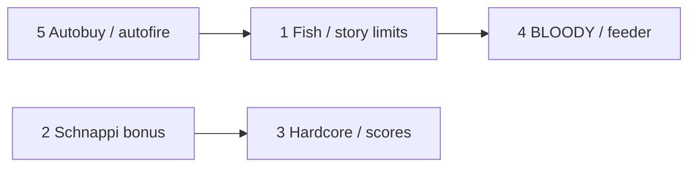

# v1 parity backlog

Implementation plan for the five gaps identified when comparing `data/` (v1 text packs) with `public/campaign/` and the current engine.

**Status:** implemented (2026-06-26) — build passes; manual QA checklist below still applies  
**Prerequisite work already merged:** per-round visuals/audio (`RoundSettings`), buy macros (`BuyScript`), `public/campaign/format.md`

Update [PLAN.md](./PLAN.md) when each phase ships.

---

## Recommended order



| Phase | Item | Effort | Why this order |
|-------|------|--------|----------------|
| **1** | Autobuy penalty + autofire toggle | Small | Isolated settings/combat; unblocks accurate Fish testing |
| **2** | Story limits (+ Fish data) | Medium | Shared rule system; only level where limits matter today |
| **3** | BLOODY + feeder | Medium | Uses combat/FX hooks from limits work; no new content |
| **4** | Hardcore + local highscores | Medium | Meta layer on top of stable campaign |
| **5** | Schnappi bonus level | Medium | Single bonus pack; converter + `13.json` + map node |

---

## 1 — Fish round limits (story limits system)

### Goal

Restore v1 **story limits**: caps and fail conditions that can be set per level (`config.storyLimits`) or per round (`round.storyLimits`). Fish is the only shipped campaign level that relies on this today.

### v1 reference

`data/fish/levels.txt` — every round sets:

```
STORY_MAX_ROUNDROCKETS: 1   # or 2
STORY_MAX_ROUNDTIME: 20000  # ms (v1 ticks; confirm against original if behaviour feels off)
```

Level-wide defaults in `config.txt` use `-1` = disabled (`STORY_MAX_TIME`, `STORY_MAX_ROCKETS`, `STORY_MAX_HUMAN`, `STORY_MIN_MONEY`, etc.).

### Schema (extend existing docs)

```typescript
// types.ts
export interface StoryLimits {
  maxTime?: number;          // -1 or omit = off; total level time (ms)
  maxRoundTime?: number;     // per-round timer (ms)
  maxRockets?: number;       // total rockets fired in level
  maxRoundRockets?: number;  // per-round rockets fired
  maxHumanDeaths?: number;   // civilians killed (level)
  minMoney?: number;         // fail if money drops below
}

// LevelConfig.storyLimits?: StoryLimits
// RoundDef.storyLimits?: Partial<StoryLimits>  // sticky merge like RoundSettings
```

Add resolver in `src/data/RoundSettings.ts` (or `StoryLimits.ts`): merge `config.storyLimits` + sticky per-round overrides.

### Runtime (`GameScene`)

| Limit | Track | Fail behaviour |
|-------|-------|----------------|
| `maxRoundRockets` | Count `spawnRocket` calls this round (team total, not per player) | Round loss → game over or round fail (match v1: **game over**) |
| `maxRockets` | Count across level | Game over |
| `maxRoundTime` | `roundElapsedMs` in `update` while `phase === 'playing'` | Round fail / game over |
| `maxTime` | `levelElapsedSec` (already tracked) | Game over |
| `maxHumanDeaths` | civilian kills this level | Game over |
| `minMoney` | `session.money` after shop / during round | Game over |

**UI:** Small HUD line when any limit active (e.g. `Rockets: 1/2 · Time: 18s`). Fish should feel like “one shot per wave”.

**Fire gate:** In `tryFireClick` / `tryFireAuto`, bail if `roundRocketsFired >= maxRoundRockets`.

### Data

Patch `public/campaign/7.json` — add per-round limits from `data/fish/levels.txt`:

| Round | `maxRoundRockets` | `maxRoundTime` |
|-------|-------------------|----------------|
| 0 | 1 | 20000 |
| 1 | 2 | 20000 |
| 2 | 1 | 20000 |
| 3 | 2 | 20000 |
| 4 | 1 | 20000 |

Document fields in `public/campaign/format.md` and `docs/03-data-format.md`.

### Files

- `src/data/types.ts`
- `src/data/RoundSettings.ts` (or new `StoryLimits.ts`)
- `src/scenes/GameScene.ts` — counters, timers, fail, HUD
- `src/ui/GameHud.ts` — optional limit display
- `public/campaign/7.json`

### Acceptance

- [ ] Fish round 1: firing twice fails the round/level
- [ ] Fish round 2: exactly 2 rockets allowed
- [ ] Levels without `storyLimits` unchanged
- [ ] Limits survive pause (timer pauses with round)

---

## 2 — Schnappi bonus level

### Goal

Port **`data/schnappi/`** only — the crocodile bonus campaign (7 rounds) that was never in the 12-level story JSON.

**Not in this plan:** `mangoo` (hard 16-round variant) and `arcade` (40-round marathon). Those stay deferred unless requested later.

| Pack | Folder | Rounds | Notes |
|------|--------|--------|-------|
| Schnappi | `data/schnappi/` | 7 | `BLOODY: 5`, `bonus.jpg` backdrop, most shop buttons disabled |

**Exclude:** `starcraft` (copyright).

### Campaign integration

Add one **bonus node** on the map — not in the linear 1–12 path:

```json
// index.json (sketch)
{ "file": "13.json", "name": "Schnappi", "mapX": …, "mapY": …, "pathType": 4, "bonus": true }
```

- `bonus: true` — unlocked when campaign is complete (see phase 3; default: after beating level 12).
- Pick map coordinates that don’t overlap the main path (e.g. near Nuke / off the eastern branch).

### Tooling

`docs/04-v1-porting.md` references `scripts/convert-v1.mjs` — **does not exist**. Create minimal converter scoped to Schnappi first:

```
scripts/convert-v1.mjs --source data/schnappi --out public/campaign/13.json --id 13
```

Pipeline per [04-v1-porting.md](./04-v1-porting.md): parse INI → scale coords → map fields → emit JSON → validate.

**Manual fixes after convert:**

- Round 0: `background` / `ground` from `CHANGE_BACKGROUND: bonus.jpg`, `CHANGE_GROUND: ground2.png`
- `buttonsDisabled` from `data/schnappi/config.txt` (rocket speed, human, HP, money, aim, rocket — only rocket power shop may stay enabled per v1)
- `bloody: 5` on config (phase 4)
- Verify `SCHNAPPI` / `SCHNAPPI2` airplane defs and screams

### Assets

Copy referenced gfx/sfx into `public/assets/`: `bonus.jpg`, `ground2.png`, Schnappi plane sprites, any unique bombs/sfx from `airplanes.txt` / `bombs.txt`.

### Files

- `scripts/convert-v1.mjs` (new — Schnappi-first; reusable for future packs)
- `public/campaign/13.json`
- `public/campaign/index.json`
- `src/data/types.ts` — `CampaignIndex` optional `bonus?: boolean`
- `src/scenes/CampaignViewScene.ts` — render/unlock bonus node
- `src/core/CampaignProgress.ts` — bonus unlock rule

### Acceptance

- [ ] Schnappi loads and plays all 7 rounds start-to-finish
- [ ] Bonus level appears on map; main 1–12 path unchanged
- [ ] Shop restrictions match v1 (disabled upgrade buttons)
- [ ] No starcraft assets in repo

---

## 3 — Hardcore mode + highscores

### Goal

**Hardcore:** After completing the campaign once, player can enable HC mode: enemy planes and bombs move at **2× speed** ([07-game-mechanics.md](./07-game-mechanics.md)).

**Highscores:** Local per-level best score (v1 `highscore.txt`); optional online upload deferred.

### v1 reference

- `data/profile.txt` — `act_level`, `act_level_hc`, `hc_enabled`, `first_start`
- `data/settings.txt` — `HCMode: OFF`, `Host` / `Script` for PHP highscores
- Per-pack `highscore.txt` — `name:score` lines

### Hardcore design

```typescript
// SettingsStore or separate ProfileStore
interface Profile {
  campaignComplete: boolean;
  hardcoreEnabled: boolean;
}
```

- Set `campaignComplete` when level 12 is beaten (before end-screen).
- Settings overlay: **Hardcore** row — visible only if `campaignComplete`; toggles `hardcoreEnabled`.
- Combat multiplier in `EntityController` / spawn / bomb velocity: `const speedMul = profile.hardcoreEnabled ? 2 : 1`.
- Persist in `localStorage` (`antiwar2_profile`).

### Highscore design (local first)

**Score formula** — mirror v1 if documented in `old/readme.txt`; otherwise use a simple proxy until tuned:

```
score = money + roundIndex * 1000 + levelElapsedSec penalty
```

Or: money remaining at level complete + time bonus. **Action:** read `old/readme.txt` during implementation and match v1 formula.

```typescript
// HighscoreStore — localStorage key antiwar2_highscores
Record<levelId, { score: number; name: string; date: string }>
```

- Prompt for initials on **new record** at level complete (modal or default `AAA`).
- Campaign map: show 🏆 or best score on level card (`CampaignLevelPreview`).
- **Online:** stub `HighscoreClient` with `upload()` no-op; wire URL from settings later if desired.

### Files

- `src/core/ProfileStore.ts` (new)
- `src/core/HighscoreStore.ts` (new)
- `src/core/SettingsStore.ts` or `SettingsOverlay.ts` — HC toggle
- `src/scenes/GameScene.ts` — speed multiplier, score on win
- `src/scenes/CampaignViewScene.ts` — display bests
- `src/ui/CampaignLevelPreview.ts`
- `src/core/CampaignProgress.ts` — `campaignComplete` flag

### Acceptance

- [ ] Beating level 12 unlocks HC toggle
- [ ] HC doubles enemy/bomb speeds; player rockets unchanged
- [ ] Best score persists per level id; shown on map
- [ ] HC state persists across sessions

---

## 4 — BLOODY level flag + feeder bombs

### Goal

- **`BLOODY`** (level config): scales civilian blood FX intensity (Fish, Schnappi, Viech use `5.0`).
- **`feeder`** (bomb def): knockback / stagger on civilians near bomb impacts (v1 `IS_FEEDER`; all overlord bombs are `0` — implement for schema completeness).

### v1 reference

- `data/fish/config.txt` — `BLOODY: 5.0`
- `data/schnappi/config.txt` — `BLOODY: 5.0`
- `docs/03-data-format.md` — `feeder` on `BombDef`

### BLOODY implementation

```typescript
// LevelConfig.bloody?: number  // default 1
```

In `spawnCivilianBloodFx` → pass `bloody: this.level.config.bloody ?? 1` into `ParticleFxManager.spawnCivilianBlood`.

In `ParticleFxManager.bloodParticleCount` / `bloodStrengthTier`: multiply tier or count by `opts.bloody` (clamp e.g. 0.5–10).

Patch JSON: `7.json`, `10.json` (Viech), `13.json` Schnappi when converted.

### Feeder implementation

```typescript
// BombDef.feeder?: number  // default 0
```

On bomb **ground impact** or **explosion** (in `handleGroundExplosion` / civilian damage radius):

- If `feeder > 0`, push nearby civilians horizontally by `feeder * factor` away from blast.
- Optional: brief walk animation interrupt (civilian `walkDist` reset).

Low priority visually if no bomb in shipped data has `feeder > 0`; still add field + one unit test or dev cheat.

### Files

- `src/data/types.ts`
- `src/systems/particles/ParticleFxManager.ts`
- `src/scenes/GameScene.ts` — bloody passthrough, feeder knockback
- Campaign JSON patches

### Acceptance

- [ ] Viech / Fish show noticeably more blood than tutorial
- [ ] `feeder` on a test bomb knocks civilians (verify via dev bomb override or overlord bomb with feeder set in test JSON)

---

## 5 — Autobuy penalty + autofire toggle

### Goal

Match v1 `settings.txt` shop/combat feel:

- **Autobuy:** after pressing autobuy, **10s cooldown** before it can be used again ([07-game-mechanics.md](./07-game-mechanics.md)).
- **Autofire:** `NORMAL` = hold to repeat (current behaviour); `OFF` = only initial click fires, no hold repeat.

### v1 reference

```
Autofire: NORMAL   # settings.txt
```

Autobuy penalty described in docs; no numeric constant in `settings.txt` (use 10s from mechanics doc).

### Autobuy penalty

```typescript
// GameScene
private autoBuyCooldownLeft = 0;

// autoBuyUpgrades(): set autoBuyCooldownLeft = 10 on success
// update shop: autoBuyCooldownLeft -= dt
// ShopOverlay: disable auto button when cooldown > 0; optional label "10s"
```

Pass `canAutoBuy: () => boolean` into `ShopOverlay` or refresh from `GameScene`.

### Autofire toggle

```typescript
// SettingsStore
autofireEnabled: boolean  // default true (NORMAL)
```

Settings overlay row: **Autofire** ON / OFF.

In `GameScene` combat loop: skip `tryFireAuto` when `!settingsStore.get().autofireEnabled`. Clicks (`tryFireClick`) always work.

Persist in existing `localStorage` settings blob.

### Files

- `src/core/SettingsStore.ts`
- `src/ui/SettingsOverlay.ts`
- `src/scenes/GameScene.ts`
- `src/ui/ShopOverlay.ts`

### Acceptance

- [ ] Autobuy twice within 10s — second press ignored
- [ ] Autofire OFF: hold mouse — single shot only
- [ ] Autofire ON: unchanged from today
- [ ] Settings persist

---

## Cross-cutting updates

| Doc | Change |
|-----|--------|
| [PLAN.md](./PLAN.md) | Remove items from “out of scope”; link here |
| [public/campaign/format.md](../public/campaign/format.md) | `storyLimits`, `bloody`, bonus levels |
| [03-data-format.md](./03-data-format.md) | Formal `storyLimits` + `bloody` on config |
| [07-game-mechanics.md](./07-game-mechanics.md) | Mark buy macros done; note HC/score when done |

---

## Testing checklist (full parity pass)

1. **Tutorial** — unchanged baseline  
2. **Sector One (2)** — desert backdrop from round 6  
3. **Fish (7)** — rocket + time limits  
4. **Viech (10)** — heavy blood  
5. **Boss + HC** — boss 3 with HC on feels brutal  
6. **Schnappi (13)** — shop restrictions + macros  
7. **Settings** — autofire off, autobuy cooldown, HC toggle gating  

---

## Out of scope (this plan)

- Starcraft campaign (copyright)
- **Mangoo (hard)** and **Arcade** bonus packs — deferred
- Online highscore PHP backend (local only unless explicitly added later)
- Per-level named buyscripts (`[MANGOO]` in `buyscript.txt`)
- `START_LEVEL` skip-to-round
- `NONE` solid-color backgrounds
- Helper spawns

---

## Estimate

| Phase | ~Days (solo) |
|-------|----------------|
| 5 Autobuy / autofire | 0.5 |
| 1 Story limits + Fish | 1–2 |
| 4 BLOODY / feeder | 1 |
| 3 Hardcore + local scores | 1–2 |
| 2 Schnappi + converter | 1–2 |
| **Total** | **~5–8 days** |

Schnappi is 7 rounds; converter is reusable if mangoo/arcade are added later.
